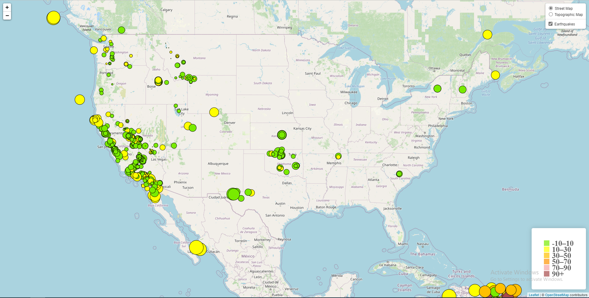
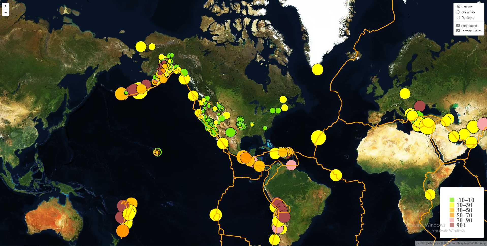

# Leaflet-Challenge

This repository contains my solution of the Leaflet Challenge Homework  - Visualizing Data with Leaflet of the GATECH Data Science and Analytics Bootcamp. Ths was to build a new set of tools that will allow to visualize earthquake data from the United States Geological Survey, or USGS for short.

This homework was completed in 2 steps:

### Level 1: Basic Visualization

1. Getting the data for the past 7 days from [USGS GeoJSON Feed](https://earthquake.usgs.gov/earthquakes/feed/v1.0/geojson.php) page.
2. Create a map using Leaflet that plots all of the earthquakes from your data set based on their longitude and latitude.
* The data markers reflect the magnitude of the earthquake by their size and depth of the earthquake by color. Earthquakes with higher magnitudes appear larger and earthquakes with greater depth should appear darker in color.
* Include popups that provide additional information about the earthquake when a marker is clicked.
* Create a legend that will provide context for your map data.
* Below is a screenshot of the visualization.

### Level 2: More Data (Optional)   

Plot a second data set on the map to illustrate the relationship between tectonic plates and seismic activity. Data on tectonic plates can be found at https://github.com/fraxen/tectonicplates.

The steps followed are:
1. Plot a second data set on my map.
2. Add a number of base maps to choose from as well as separate out our two different data sets into overlays that can be turned on and off independently.
3. Add layer controls to my map.
* Below is a screenshot of the visualization.

